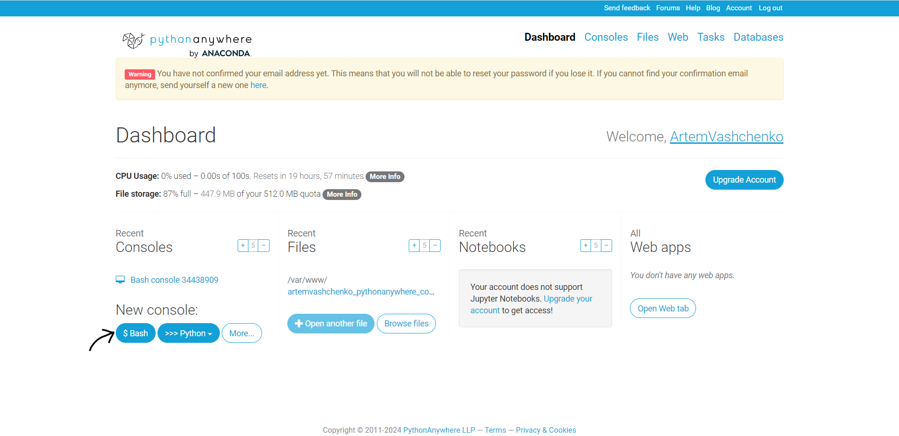

# Генератор QR-кодів/QR-Code generator
---
## Генератор QR-кодів - проєкт, який був створений для створювання кастомізованих QR-кодів, які користувач зберігає на сайті
QR Code Generator is a project that was created to create customized QR codes that the user saves on the site.
---
## Знаходячись на сайті ви можете: 
- **Створити акаунт**
- **Увійти в акаунт**
- **Створити** QR-код
- **Кастомізувати** та **видаляти** QR-код
- **Зв'язатися** з розробниками
- **Задати** та **змінити** підписку

## While on the site you can: 
- **Create an account**
- **Log in to your account**
- **Create** a QR code
- **Customize** and **delete** a QR code
- **Contact** the developers
- **Set** and **change** a subscription

## Над цим проєктом працювали/They worked on the project:
**Ващенко Артем(TeamLead)**: https://github.com/VashchenkoArtem
**Кирило Харлан**: https://github.com/KirillKharlan
**Марков Дмитро**: https://github.com/DmitriyM08
**Архіп Гончар**: https://github.com/Arhip-ops

## Посилання на figma дизайн/ Link on figma design file: 
https://www.figma.com/design/09TXxVuloOwYY96sCny7ie/Design-For-QR-Code-Practice?node-id=0-1&p=f&t=3qrRc0rj35zyk61W-0

Цей проєкт **корисний** для **початківців** тим, що під час **праці** над ним **задіюється робота** з **базами даних**, **CSS** та **HTML**.

This project is **useful** for **beginners** because **working** on it **involves** working with **databases**, **CSS**, and **HTML**.

## В проєкті **використовувались** такі **бібліотеки**:
- **Django** (**Створення** сайту)
- **Qrcode** (**Робота** з **qr-кодами**)
- **Pillow** (**Робота** з **зображеннями**)

## The following **libraries** were **used** in the project:
- **Django** (**Creating** a website)
- **Qrcode** (**Working** with **qr-codes**)
- **Pillow** (**Working** with **images**)

## Як запустити проєкт локально?/How to run a project locally?

1. **Встановіть Git** та **VisualStudioCode**, якщо ще **не встановлено** \ **Install Git** and **VisualStudioCode** if **not already installed**
2. **Відкрийтe VisualStudioCode** \  **Open VisualStudioCode**
3. **Створіть** або **відкрийте** необхідну **папку**, в якій буде знаходитися **проєкт** \ **Create** or **open** the necessary **folder** where the **project** will be located.
4.**Відкрийте термінал** і **пропишіть** \ **Open a terminal** and **type**:
```python
git clone https://github.com/VashchenkoArtem/Django_QRCode_App
```
5. **Створіть** **віртуальне оточення** \ **Create a virtual env**:
```python
python -m venv <namevenv>
```
6. **Активуйте** його \ **Activate** it:
###  MacOS та Linux
```python
source <namevenv>/bin/activate
```
### Windows 
```python
.\<namevenv>\Scripts\activate.bat
```
7. **Встановіть** необхідні **бібліотеки** в **віртуальне оточення** з файлу **requirements.txt** 
**Install** the required **libraries** into the **virtual environment** from the **requirements.txt** file
```python
pip install -r requirements.txt
```
8. **Перейдіть** в папку **Django_QRCode_App**, якщо ви **не там** \ **Go** to the **Django_QRCode_App** folder if you are **not there**
```python
cd Django_QRCode_App
```
9. **Запустіть** сервер \ **Run** the server
```python
python manage.py runserver
```
10.  **Натисніть** на **посилання** \ **Click** on **link**:


11.  Вітаємо! Ви **локально** **запустили** проєкт! \\ Congratulations! You have **locally** **launched** the project!

## Як запустити проєкт на pythonanywhere? \ How to run a project at pythonanywhere?
1. **Перейти** на **сайт** pythonanywhere
2. **Зареєструватися** там, якщо ще не зареєстровані
3. **Створюємо** нову **bash** консоль

4. **Клонуємо** репозиторій. Прописуємо в консолі:
```
git clone https://github.com/VashchenkoArtem/Django_QRCode_App
```
5. **Створюємо** віртуальне оточення
```
mkvirtualenv <venv_name> --python=python3.10
```
6. Переходимо в дерикторію проєкта:
```python
cd Django_QRCode_App
```
7. **Встановлюємо** всі необхідні модулі
```
pip install -r requirements.txt
```
8. **Виходимо** з консолі, **натиснувши** стрілочку наліво в лівому верхньому кутi та **заходимо** у вкладку **Web**

9. Створюємо додаток натиснувши на кнопку **Add a new app** і далі **натискаємо** на **Next**

10. **Обираємо** framework **Django** і натискаємо **Next**

11.  **Обираємо** версію **Python 3.10** і натискаємо **Next**

12. Вказуємо **назву сайта** та в **директорії** вказуємо:
```python
/home/<YourName>/Django_QRCode_App
``` 
## Структура проєкта \ Structure of project


## За що відповідає кожен з додатків? \ What is each application responsible for?

- ### **Додаток home_app** \ **Application home_app**

Додаток **home_app** відповідає за **головну** сторінку. Тобто **відображення** усього **функціоналу** сайту. Наприклад: Виду **підписок** або **генерування** QR-коду \ The **home_app** application is responsible for the **main** page. That is, **displaying** all **functionality** of the site. For example: Viewing **subscriptions** or **generating** a QR code

- ### Додаток registration1 \ Registration1 application

Додаток **registration1** відповідає за **заповнення форми**, яка потім **відправляється на обробку на сервер**. Якщо **форма** заповнена **правильно** - **користувача реєструє** в **базу** **даних** та **перекидує** на іншу **сторінку** \ The **registration1** application is responsible for **filling out the form**, which is then **sent to the server for processing**. If the **form** is filled in **correctly** - it **registers** the user** into the **database** and **redirects** him/her** to another **page**

### Додаток registration3 \ Registration3 application

Додаток **registration3** відповідає за **успішну реєстрацію**. Після **натискання** на кнопку **"Авторизація"** - користувача **перекидує** на **авторизацію** \ The **registration3** application is responsible for **successful registration**. After **clicking** on the **"Authorization"** button - the user **is redirected** to **authorization**

### Додаток authorithation1 \ Authorithation1 application

Додаток **authorithation1** відповідає за **авторизацію** користувача. Користувач **заповнює** форму та якщо вона **правильно заповнена** - користувач **переходе** на **2 етап перевірки** \ The **authorithation1** application is responsible for **authorization** of the user. The user **fills** in the form and if it is **correctly filled** in - the user **proceeds** to **stage 2 of verification**

### Додаток authorithation2 \ Authorithation2 application

Додаток **authorithation2** відповідає за **відправку повідомлення на пошту**, яку **вказав** користувач. Ця сторінка **служить** **другим етапом перевірки** \ The **authorithation2** application is responsible for **sending a message to the email address** that the user **specified**. This page **serves** as the **second stage of verification**

### Додаток authorithation3 \ Authorithation3 application

Додаток **authorithation3** відповідає за **успішну авторизацію**. Якщо все пройшло **успішно** - людину **авторизує** та **перекидає** на **головну** / The **authorithation3** application is responsible for **successful authorization**. If everything went **successfully**, it **authorizes** the person and **transfers** them to the **main** page.

### Додаток subscribe \ Subscribe application

Додаток **subscribe** відповідає за **задання підписки** користувачу, в залежності від того, на яке **посилання** він **натисне** на **головній сторінці**. \ The **subscribe** application is responsible for **assigning** a subscription to a user, depending on which **link** they **click** on the **homepage**.
#### Види підписок: \ Types of subscriptions:

-  **Free** (**1 безкоштовний** qr-код на **6 місяців**) \ **Free** (**1 free** QR code for **6 months**)
  
- **Standart** (**10 qr-кодів** на **6 місяців** за **2\$** за місяць) \ **Standart** (**10 QR codes** for **6 months** for **$2** per month)

- **Pro** (**100 qr-кодів** на **6 місяців** за **10\$** за місяць) \ **Pro** (**100 QR codes** for **6 months** for **$10** per month)

- **Desktop** (**5**, **10** або **20 qr-кодів** з **посиланням** на **desktop** додатки на **6 місяців** за **50 центів**, **1\$** або **2\$**)  **Desktop** (**5**, **10** or **20 QR codes** with a **link** to the **desktop** application for **6 months** for **50 cents**, **1\$** or **2\$**)

### Додаток qrgenerate_app \ Qrgenerate_app application

Додаток **qrgenerate_app** відповідає за **генерацію будь-якого qr-кода**, якщо **користувач** ще **може** робити **qr-коди**. Якщо у **користувача** вже є **максимальна кількість qr-кодів**, яка **вказана** в **підписці** - йому **виведе попередження** та **qr-код не створиться**. \ The **qrgenerate_app** application is responsible for **generating any qr code** if the **user** can still **make **qr codes**. If the **user** already has the **maximum number of qr codes**, which is **specified** in the **subscription** - he will **get a warning** and **the qr code will not be created**.

### Додаток my_codes \ My_codes application

Додаток **my_codes** відповідає за **збереження усіх qr-кодів**, які **створив** користувач. Користувач може **переглянути** **більшe** даних про **qr-код**, **натиснувши** на **назву qr-кода**. Якщо у користувача **завершилася підписка** - у нього буде працювати лише **1**, **останньо створенний qr-код**, а **всі інші** **заблокуються**. \ The **my_codes** application is responsible for **saving all qr-codes** that **the user has created**. The user can **view** **more** data about the **qr-code** by **clicking** on the **qr-code name**. If the user has **expired their subscription** - only **1**, **the last created qr-code** will work, and **all others** will **be blocked**.

### Додаток contacts \ Contacts application


Додаток **contacts** відповідає за **зворотній зв'язок до розробників**. \ The **contacts** application is responsible for **feedback to developers**.

### Папка media \ Media folder

В **проєкті** ми **використали** папку "**media**", як папку, в якій **зберігаються** всі **медійні файли**(**в нашому випадку qr-коди**). \ In the **project** we **used** the "**media**" folder as the folder in which **all** media files** (**in our case, QR codes**) are **stored**.

### Додаток images_readme \ Images_readme folder

Цю **папку** було **створено** для **збереження** в ній **зображень**, які ми **відобразили** в файлі **readme.md**. \ This **folder** was **created** to **store** the **images** that we **displayed** in the **readme.md** file.

### Папка templates \ Templates folder

В цій **папці** ми **створили базовий html шаблон**, який ми **використовували** для **інших додатків**. \ In this **folder** we **created a basic html template** that we **used** for **other applications**.

### Файл .gitignore \ .gitignore file 

В цьому **файлі** ми **задаємо папки** або **файли**, які ми **не включаємо** в **commit**. \ In this **file** we **specify folders** or **files** that we **do not** include in the **commit**.

### Файл db.sqlite3 \ Db.sqlite3 file

Це наша **база даних**, в якіх **зберігаються** **таблиці** по типу: **django_session**, **auth_user**... \ This is our **database**, which **stores** **tables** of the following types: **django_session**, **auth_user**...

### Файл manage.py \ Manage.py file

Цей **файл** ми **використовуємо** для **запуску проєкта**. \ We **use** this **file** to **launch the project**.

### Файл readme.md \ Readme.md file

Цей **файл** ми **використовуємо** для **опису** всього **проєкта** в ньому. \ We **use** this **file** to **describe** the entire **project** in it.

### Файл requirements.txt \ Requirements.txt file

В цьому **файлі** ми **створили** всі **необхідні** **бібліотеки** та їх **версії** для **запуску проєкта**. \ In this **file** we **created** all the **necessary** **libraries** and their **versions** to **launch the project**.