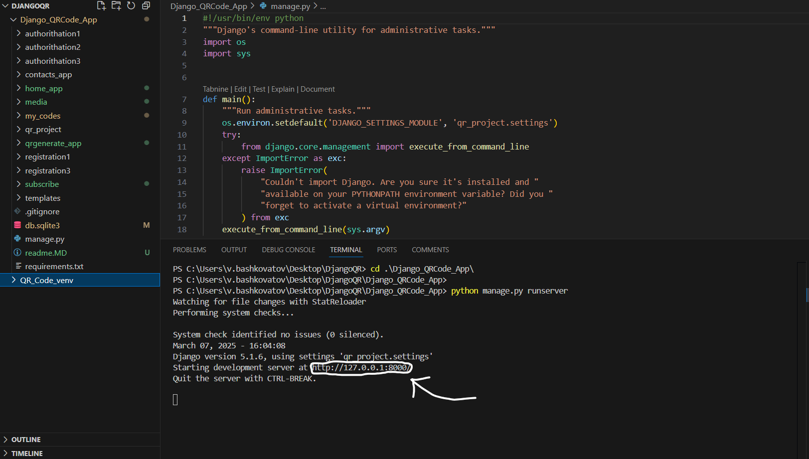

<h1 align = "center">Генератор QR-кодів/QR-Code generator</h1>


# Генератор QR-кодів/QR-Code generator
---
## Генератор QR-кодів - проєкт, який був створений для створювання кастомізованих QR-кодів, які користувач зберігає на сайті
QR Code Generator is a project that was created to create customized QR codes that the user saves on the site.
---
## Навігація по README \ Navigation on README:
- **[Функціонал сайту \ Site functionality](#знаходячись-на-сайті-ви-можете)**
- **[Ціль проєкта \ The goal of the project](#ціль-проєкта)**
- **[Розробники \ Developers](#над-цим-проєктом-працювали--they-worked-on-the-project)**
- **[Посилання на Figma та FigJam \ Links to Figma and FigJam](#посилання-на-figma-дизайн--link-on-figma-design-file)**
- **[Бібліотеки, які використовувались в проєкті \ Libraries used in the project](#в-проєкті-використовувались-такі-бібліотеки)**
- **[Локальний запуск проєкту \ Local project launch](#як-запустити-проєкт-локальноhow-to-run-a-project-locally)**
- **[Структура проєкта \ Structure of project](#структура-проєкта--structure-of-project)**
- **[Функціонал кожного з додатків \ Functionality of each application](#за-що-відповідає-кожен-з-додатків--what-is-each-application-responsible-for)**
- **[Принцип збереження QR кодів в проєкті \ The principle of storing QR codes in a project](#збереження-qr-кодів--saving-qr-codes)**
- **[Views.py, models.py та index.html в проєкті \ Views.py, models.py and index.html in the project](#viewspy-indexhtml-та-modelspy-які-були-створенні-у-нашому-проєкті)**
## Знаходячись на сайті ви можете: 
- **Створити акаунт**
- **Увійти в акаунт**
- **Створити** QR-код
- **Кастомізувати** та **видаляти** QR-код
- **Зв'язатися** з розробниками
- **Задати** та **змінити** підписку

## While on the site you can: 
- **Create an account**
- **Log in to your account**
- **Create** a QR code
- **Customize** and **delete** a QR code
- **Contact** the developers
- **Set** and **change** a subscription

## Ціль проєкта
Нашою **ціллю** було **створення зручного генераторат QR-кодів**, де людина може **обрати** будь-яку **кастомізацію**

## Над цим проєктом працювали \ They worked on the project:

**Ващенко Артем(TeamLead)**: https://github.com/VashchenkoArtem

**Кирило Харлан**: https://github.com/KirillKharlan

**Марков Дмитро**: https://github.com/DmitriyM08

**Архіп Гончар**: https://github.com/Arhip-ops

## Посилання на figma дизайн \ Link on figma design file: 
https://www.figma.com/design/09TXxVuloOwYY96sCny7ie/Design-For-QR-Code-Practice?node-id=0-1&p=f&t=3qrRc0rj35zyk61W-0
## Посилання на схему роботи баз даних у проєкті \ Adding to the project database workflow
https://www.figma.com/board/XKc7HNrlSccatNZPn3CmGw/%D0%A1%D1%85%D0%B5%D0%BC%D0%B0-QR-%D0%BA%D0%BE%D0%B4%D1%96%D0%B2?node-

Цей проєкт **корисний** для **початківців** тим, що під час **праці** над ним **задіюється робота** з **базами даних**, **CSS** та **HTML**.

This project is **useful** for **beginners** because **working** on it **involves** working with **databases**, **CSS**, and **HTML**.

## В проєкті **використовувались** такі **бібліотеки**:
- **Django** (**Створення** сайту)
- **Qrcode** (**Робота** з **qr-кодами**)
- **Pillow** (**Робота** з **зображеннями**)

## The following **libraries** were **used** in the project:
- **Django** (**Creating** a website)
- **Qrcode** (**Working** with **qr-codes**)
- **Pillow** (**Working** with **images**)

## Як запустити проєкт локально?/How to run a project locally?

1. **Встановіть Git** та **VisualStudioCode**, якщо ще **не встановлено** \ **Install Git** and **VisualStudioCode** if **not already installed**
2. **Відкрийтe VisualStudioCode** \  **Open VisualStudioCode**
3. **Створіть** або **відкрийте** необхідну **папку**, в якій буде знаходитися **проєкт** \ **Create** or **open** the necessary **folder** where the **project** will be located.
4.**Відкрийте термінал** і **пропишіть** \ **Open a terminal** and **type**:
```python
git clone https://github.com/VashchenkoArtem/Django_QRCode_App
```
5. **Створіть** **віртуальне оточення** \ **Create a virtual env**:
```python
python -m venv <namevenv>
```
6. **Активуйте** його \ **Activate** it:
###  MacOS та Linux
```python
source <namevenv>/bin/activate
```
### Windows 
```python
.\<namevenv>\Scripts\activate.bat
```
7. **Встановіть** необхідні **бібліотеки** в **віртуальне оточення** з файлу **requirements.txt** 
**Install** the required **libraries** into the **virtual environment** from the **requirements.txt** file
```python
pip install -r requirements.txt
```
8. **Перейдіть** в папку **Django_QRCode_App**, якщо ви **не там** \ **Go** to the **Django_QRCode_App** folder if you are **not there**
```python
cd Django_QRCode_App
```
9. **Запустіть** сервер \ **Run** the server
```python
python manage.py runserver
```
10.  **Натисніть** на **посилання** \ **Click** on **link**:


11.  Вітаємо! Ви **локально** **запустили** проєкт! \\ Congratulations! You have **locally** **launched** the project!

## Структура проєкта \ Structure of project


## За що відповідає кожен з додатків? \ What is each application responsible for?

- ### **Додаток home_app** \ **Application home_app**

Додаток **home_app** відповідає за **головну** сторінку. Тобто **відображення** усього **функціоналу** сайту. Наприклад: Виду **підписок** або **генерування** QR-коду \ The **home_app** application is responsible for the **main** page. That is, **displaying** all **functionality** of the site. For example: Viewing **subscriptions** or **generating** a QR code

- ### Додаток registration1 \ Registration1 application

Додаток **registration1** відповідає за **заповнення форми**, яка потім **відправляється на обробку на сервер**. Якщо **форма** заповнена **правильно** - **користувача реєструє** в **базу** **даних** та **перекидує** на іншу **сторінку** \ The **registration1** application is responsible for **filling out the form**, which is then **sent to the server for processing**. If the **form** is filled in **correctly** - it **registers** the user** into the **database** and **redirects** him/her** to another **page**

### Додаток registration3 \ Registration3 application

Додаток **registration3** відповідає за **успішну реєстрацію**. Після **натискання** на кнопку **"Авторизація"** - користувача **перекидує** на **авторизацію** \ The **registration3** application is responsible for **successful registration**. After **clicking** on the **"Authorization"** button - the user **is redirected** to **authorization**

### Додаток authorithation1 \ Authorithation1 application

Додаток **authorithation1** відповідає за **авторизацію** користувача. Користувач **заповнює** форму та якщо вона **правильно заповнена** - користувач **переходе** на **2 етап перевірки** \ The **authorithation1** application is responsible for **authorization** of the user. The user **fills** in the form and if it is **correctly filled** in - the user **proceeds** to **stage 2 of verification**

### Додаток authorithation2 \ Authorithation2 application

Додаток **authorithation2** відповідає за **відправку повідомлення на пошту**, яку **вказав** користувач. Ця сторінка **служить** **другим етапом перевірки** \ The **authorithation2** application is responsible for **sending a message to the email address** that the user **specified**. This page **serves** as the **second stage of verification**

### Додаток authorithation3 \ Authorithation3 application

Додаток **authorithation3** відповідає за **успішну авторизацію**. Якщо все пройшло **успішно** - людину **авторизує** та **перекидає** на **головну** / The **authorithation3** application is responsible for **successful authorization**. If everything went **successfully**, it **authorizes** the person and **transfers** them to the **main** page.

### Додаток subscribe \ Subscribe application

Додаток **subscribe** відповідає за **задання підписки** користувачу, в залежності від того, на яке **посилання** він **натисне** на **головній сторінці**. \ The **subscribe** application is responsible for **assigning** a subscription to a user, depending on which **link** they **click** on the **homepage**.
#### Види підписок: \ Types of subscriptions:

-  **Free** (**1 безкоштовний** qr-код на **6 місяців**) \ **Free** (**1 free** QR code for **6 months**)
  
- **Standart** (**10 qr-кодів** на **6 місяців** за **2\$** за місяць) \ **Standart** (**10 QR codes** for **6 months** for **$2** per month)

- **Pro** (**100 qr-кодів** на **6 місяців** за **10\$** за місяць) \ **Pro** (**100 QR codes** for **6 months** for **$10** per month)

- **Desktop** (**5**, **10** або **20 qr-кодів** з **посиланням** на **desktop** додатки на **6 місяців** за **50 центів**, **1\$** або **2\$**)  **Desktop** (**5**, **10** or **20 QR codes** with a **link** to the **desktop** application for **6 months** for **50 cents**, **1\$** or **2\$**)

### Додаток qrgenerate_app \ Qrgenerate_app application

Додаток **qrgenerate_app** відповідає за **генерацію будь-якого qr-кода**, якщо **користувач** ще **може** робити **qr-коди**. Якщо у **користувача** вже є **максимальна кількість qr-кодів**, яка **вказана** в **підписці** - йому **виведе попередження** та **qr-код не створиться**. \ The **qrgenerate_app** application is responsible for **generating any qr code** if the **user** can still **make **qr codes**. If the **user** already has the **maximum number of qr codes**, which is **specified** in the **subscription** - he will **get a warning** and **the qr code will not be created**.

### Додаток my_codes \ My_codes application

Додаток **my_codes** відповідає за **збереження усіх qr-кодів**, які **створив** користувач. Користувач може **переглянути** **більшe** даних про **qr-код**, **натиснувши** на **назву qr-кода**. Якщо у користувача **завершилася підписка** - у нього буде працювати лише **1**, **останньо створенний qr-код**, а **всі інші** **заблокуються**. \ The **my_codes** application is responsible for **saving all qr-codes** that **the user has created**. The user can **view** **more** data about the **qr-code** by **clicking** on the **qr-code name**. If the user has **expired their subscription** - only **1**, **the last created qr-code** will work, and **all others** will **be blocked**.

### Додаток contacts \ Contacts application


Додаток **contacts** відповідає за **зворотній зв'язок до розробників**. \ The **contacts** application is responsible for **feedback to developers**.

### Папка media \ Media folder

В **проєкті** ми **використали** папку "**media**", як папку, в якій **зберігаються** всі **медійні файли**(**в нашому випадку qr-коди**). \ In the **project** we **used** the "**media**" folder as the folder in which **all** media files** (**in our case, QR codes**) are **stored**.

### Додаток images_readme \ Images_readme folder

Цю **папку** було **створено** для **збереження** в ній **зображень**, які ми **відобразили** в файлі **readme.md**. \ This **folder** was **created** to **store** the **images** that we **displayed** in the **readme.md** file.

### Папка templates \ Templates folder

В цій **папці** ми **створили базовий html шаблон**, який ми **використовували** для **інших додатків**. \ In this **folder** we **created a basic html template** that we **used** for **other applications**.

### Файл .gitignore \ .gitignore file 

В цьому **файлі** ми **задаємо папки** або **файли**, які ми **не включаємо** в **commit**. \ In this **file** we **specify folders** or **files** that we **do not** include in the **commit**.

### Файл db.sqlite3 \ Db.sqlite3 file

Це наша **база даних**, в якіх **зберігаються** **таблиці** по типу: **django_session**, **auth_user**... \ This is our **database**, which **stores** **tables** of the following types: **django_session**, **auth_user**...

### Файл manage.py \ Manage.py file

Цей **файл** ми **використовуємо** для **запуску проєкта**. \ We **use** this **file** to **launch the project**.

### Файл readme.md \ Readme.md file

Цей **файл** ми **використовуємо** для **опису** всього **проєкта** в ньому. \ We **use** this **file** to **describe** the entire **project** in it.

### Файл requirements.txt \ Requirements.txt file

В цьому **файлі** ми **створили** всі **необхідні** **бібліотеки** та їх **версії** для **запуску проєкта**. \ In this **file** we **created** all the **necessary** **libraries** and their **versions** to **launch the project**.
## Збереження QR кодів \ Saving QR codes
В нашому проєкті ми зберігаємо наші qr коди в той час, коли на сторінці qrgenerate_app користувач створює qr код. Він зберігається в базі даних qrgenerate_app_qr_codes. Код, в якому створюється об'єкт qr кода та зберігається у базі даних: \ In our project we store our qr codes while on the qrgenerate_app page the user creates a qr code. It is stored in the qrgenerate_app_qr_codes database. The code in which the qr code object is created and stored in the database:
```python
# Створюємо умову, якщо користувач ще не створив максимальну кількість qr-кодів \ We create a condition if the user has not yet created the maximum number of QR codes
if len(QR_Codes.objects.filter(user_id=request.user.id)) < user_subscribe.max_count_qrs:
    # Знаходимо теперешній час \ Finding the present tense
    date_now = datetime.datetime.now()
    # Форматуємо його у потрібний формат \ Format it in the desired format
    date = datetime.datetime.strftime(date_now, "%Y-%m-%d %H:%M:%S")
    format_date = f"{date.split(':')[0].split('-')[2].split(' ')[0]}.{date.split(':')[0].split('-')[1].split(' ')[0]} {date.split(':')[0].split('-')[2].split(' ')[1]}:{date.split(':')[1].split('-')[0].split(' ')[0]}"
    # Створюємо об'єкт qr-кода в базі даних \ Create qrcode object in database
    qr_code = QR_Codes.objects.create(user=request.user, name=name_code, url=url_code, date_created=format_date)
    # Створюємо об'єкт редіректа цього qr-кода \ We create a redirect object for this qr code
    redirect_object = Redirect_QR.objects.create(qrcode=name_code, url=url_code, qr= QR_Codes.objects.get(id = qr_code.id))
# Якщо користувач створив максимальну кількість qr-кодів \ If the user has created the maximum number of QR codes
else:
    # Створюємо об'єкт помилки \ Creating an error object
    error = "Занадто багато QR-кодів!"
# Створюємо дерикторію до папки, де храняться всі qr коди користувача \ We create a directory to the folder where all the user's QR codes are stored
user_folder = os.path.join('qr_codes', request.user.username)
# Перетворюємо зображення в  IO \ Convert image into IO
img_io = io.BytesIO()
# Зберігаємо зображення у форматі png \ Convert image into png format
img.save(img_io, format="PNG")
# Перетворюємо зображення в формат ContentFile \ Convert image into format ContentFile 
img_content = ContentFile(content=img_io.getvalue(), name=f"{name_code}.png")
# Створюмєо шлях до файлу \ Create path to file
file_path = os.path.join(user_folder, f"{name_code}.png")
# Створюємо умову, якщо qr код існує \ Створюємо умову, якщо qr код існує
if qr_code:
    # Зберігаємо зображення qr кода \ Save qr code image
    qr_code.image.save(file_path, img_content)
    # Зберігаємо qr код \  Save qr code
    qr_code.save()
```

## Views.py, index.html та models.py, які були створенні у нашому проєкті
- Всі наші **views.py** з точним описом ви можете знайти, перейшовши за <a href = "readme_files/all_views.md">посиланням</a>
- Всі наші index.html ви можете переглянути за <a href = "readme_files/all_index.md">посиланням</a>
- Всі наші models.py з точним описом ви можете знайти, перейшовши за <a href = "readme_files/all_models.md">посиланням</a>

# Висновок
Для нас цей проєкт виявився дуже складним тому, що з **framework-ом Django** ми до цього **ніколи не працювали**. Ми **вивчали** його **функції**, **методи**, **класи**, як **створювати** проєкти, як **відображати** сторінки і так далі. Також, під час **виконання** цього проєкту, ми **дізналися** про **зв'язки** в **Базі Даних**. Наприклад: **One-To-One**, **One-To-Many**, **Many-To-Many**. Вони виявились **дуже зручними** для нас. Ми **вперше** **створили Figma-дизайн** до проєкту, використовуючи **autolayout** і **компоненти**. Ще, у нас були **схеми FigJam**, де був **зображений принцип роботи БД в проєкті**. Також, ми **вперше** **зверстали** **проєкт по шаблону**, який ми **створили** в **Figma**(Зверстування вебсайту - процес створення вебсторінки із попередньо створеного макету дизайну сайту, заздалегідь намальованого за допомогою графічних редакторів). Крім того, **роботу з qr-кодами** ми теж виконували **вперше**, спочатку навіть незная яку бібліотеку використовувати. Ми дізналися про бібліотеку **qrcode**, яка **генерує qr-коди** і **використали** її в проєкті. До того ж, у нас в проєкті використані **підписки**, які ми теж до цього **не робили**. Ми створили **Базу Даних**, де **храниться підписка користувача** та **інформація** про неї. Зрозумуло ж, що під час виконання проєкту у нас **виникли труднощі**. Наприклад з **qr-кодами**: бібліотека **qrcode** створювала зображення qr-кода **не в тому форматі**, який ми зберігаємо в **static**. Тому нам довелося власноруч **перетворювати** це у **необхідний** формат. Ще одна неприємна проблема з форматом - **задання кольору qr-коду**. В нашому проєкті, **колір** qr-коду задається через **RadialGradiantColorMask**, в якому є 3 параметри: back_color, edge_color i center_color. Всі вони **відповідають** за **колір** qr-кода, який користувач ввів на сайті. Але, формат, який **необхіден** для задання кольору через **RadialGradiantColorMask** та формат кольорів, які ми отримуємо з **сайту** - **відрізняються**. Тому, ми **створили функцію hex_to_rgb**, щоб **перетворювати кольори в необхідний формат**.
Я вдячен всім, хто працював зі мною над цим проєктом. Це був неймовірний проєкт та ми впевнені, що досвід який ми отримали обов'якзково знадобиться нам в дальнішомих проєктах!
# Conclusion
This project turned out to be very difficult for us because we had **never worked** with the **Django framework** before. We **studied** its **functions**, **methods**, **classes**, how to **create** projects, how to **display** pages, and so on. Also, during **the implementation** of this project, we **learned** about **relationships** in the **Database**. For example: **One-To-One**, **One-To-Many**, **Many-To-Many**. They turned out to be **very convenient** for us. We **first** **created a Figma design** for the project, using **autolayout** and **components**. Also, we had **FigJam diagrams**, which **depicted the principle of the DB in the project**. Also, for the **first time** we **built** a **project based on a template** that we **created** in **Figma** (Website building is the process of creating a web page from a pre-created site design layout, previously drawn using graphic editors). In addition, we also **worked with qr-codes** for the **first time**, at first not even knowing which library to use. We learned about the **qrcode** library, which **generates qr-codes** and **used** it in the project. In addition, our project used **subscriptions**, which we also **hadn't done before**. We created a **Database**, where **the user's subscription** and **information** about it are stored. It is understandable that during the project we **had difficulties**. For example, with **qr-codes**: the **qrcode** library created a qr-code image **in the wrong format** that we store in **static**. Therefore, we had to **convert** it into the **necessary** format ourselves. Another unpleasant problem with the format is **setting the color of the qr code**. In our project, the **color** of the qr code is set via **RadialGradiantColorMask**, which has 3 parameters: back_color, edge_color and center_color. All of them **responsible** for the **color** of the qr code that the user entered on the site. However, the format that is **necessary** for setting the color via **RadialGradiantColorMask** and the format of the colors that we receive from **the site** are **different**. Therefore, we **created the hex_to_rgb** function to **convert colors into the required format**.
I am grateful to everyone who worked with me on this project. It was an incredible project and we are sure that the experience we gained will definitely be useful to us in future projects!
